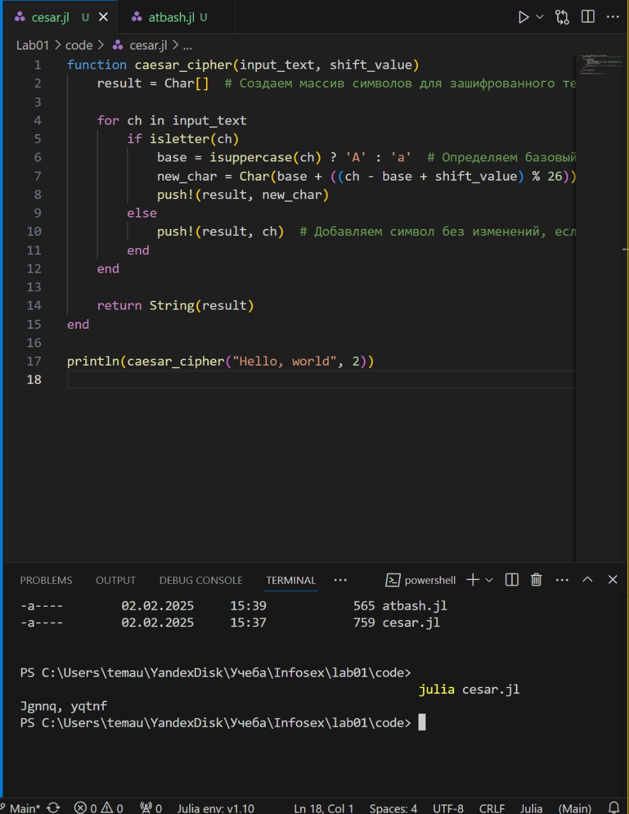
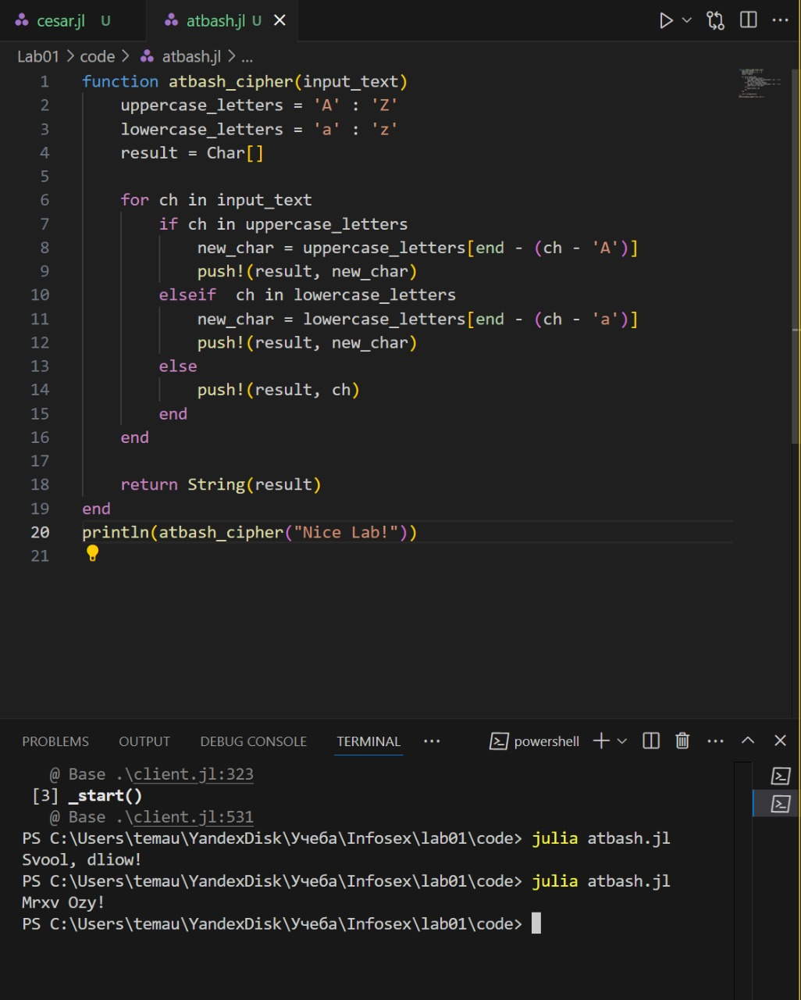

---
## Front matter
title: "Лабораторная работа № 1"
subtitle: "Шифры простой Замены"
author: "Юрченко Артём Алексеевич"

## Generic options
lang: ru-RU
toc-title: "Содержание"

## PDF output format
toc: true # Table of contents
toc-depth: 2
fontsize: 12pt
papersize: a4
documentclass: beamer

## Fonts
mainfont: Noto Serif
romanfont: Noto Serif
sansfont: Noto Sans
monofont: Noto Mono
mainfontoptions: Ligatures=TeX
romanfontoptions: Ligatures=TeX
sansfontoptions: Ligatures=TeX,Scale=MatchLowercase
---

# Введение

## Введение

Шифры перестановки преобразуют открытый текст в криптограмму путем перестановки его символов. Способ, каким при шифровании переставляются буквы открытого текста, и является ключом шифра. Важным требованием является равенство длин ключа и исходного текста.

## Цели и задачи

1. Изучить шифры простой замены.

2. Реализовать шифр Цезаря с произвольным ключом k.

3. Реализовать шифр Атбаш.

# Шифр Цезаря 

## Реализация шифра Цезаря 

Используя язык программирования Julia приступим к реализации кода для шифра Цезаря с произвольным ключом k.

## {width=50%}

# Шифр Атбаш

## Реализация Атбаш

Приступим к реализации шифра атбаш на языке Julia.

## {width=50%}

# Итоги

## Заключение

В рамках данной лабораторной работы были получены практические навыки в написании простых методов шифрования на языке Julia.