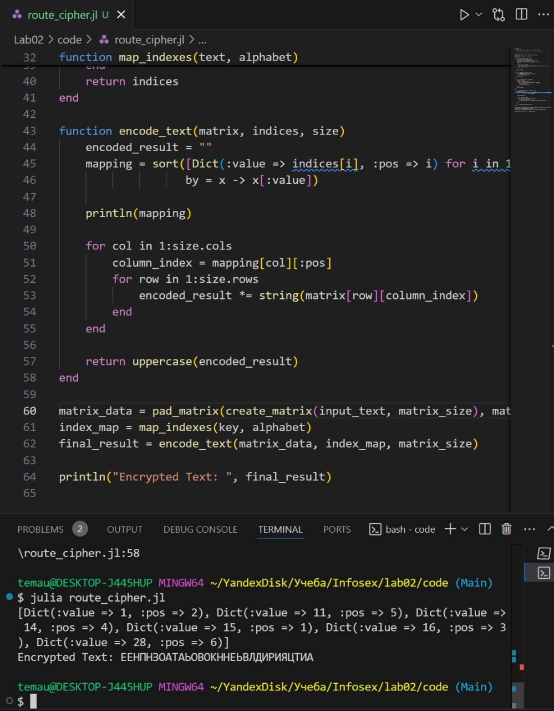
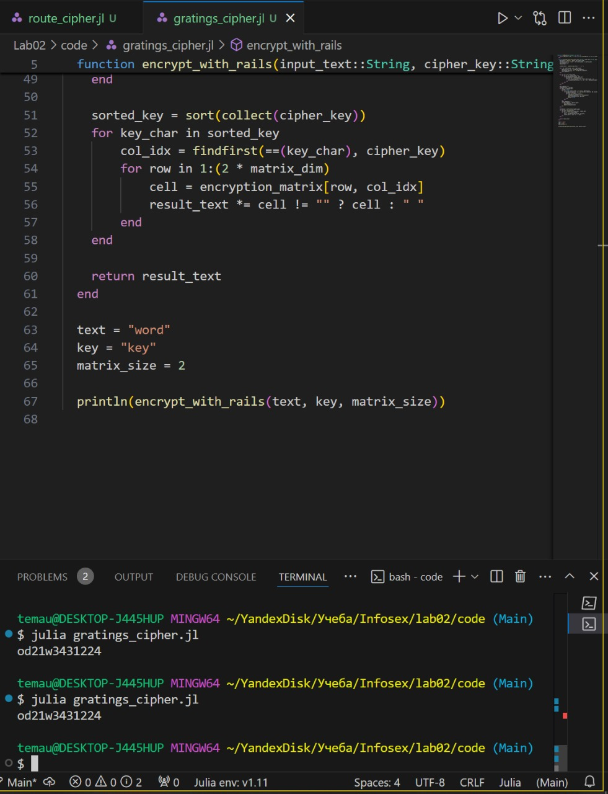
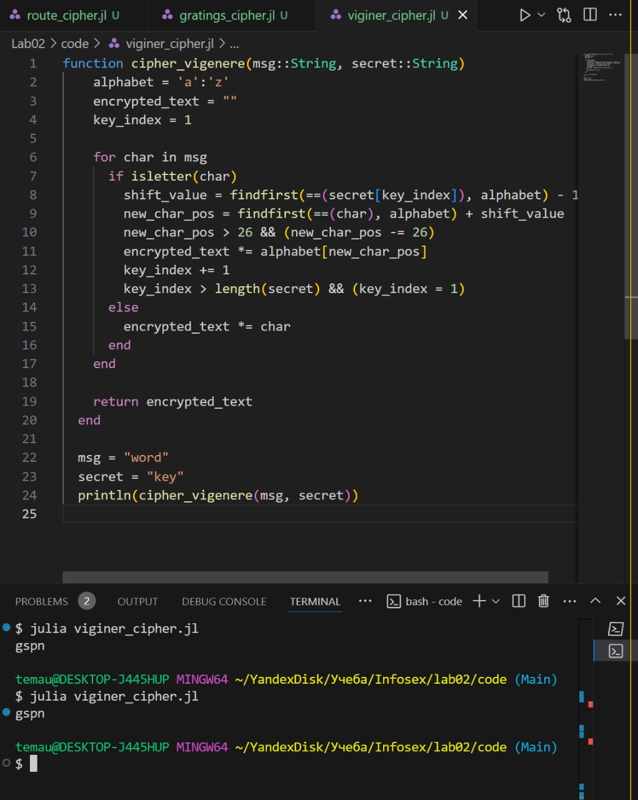

---
## Front matter
title: "Лабораторная работа № 2"
subtitle: "Шифры перестановки"
author: "Юрченко Артём Алексеевич"

## Generic options
lang: ru-RU
toc-title: "Содержание"

## PDF output format
toc: true # Table of contents
toc-depth: 2
fontsize: 12pt
papersize: a4
documentclass: beamer

## Fonts
mainfont: Noto Serif
romanfont: Noto Serif
sansfont: Noto Sans
monofont: Noto Mono
mainfontoptions: Ligatures=TeX
romanfontoptions: Ligatures=TeX
sansfontoptions: Ligatures=TeX,Scale=MatchLowercase
---

# Введение

## Введение

Шифры перестановки преобразуют открытый текст в криптограмму путем перестановки его символов. Способ, каким при шифровании переставляются буквы открытого текста, и является ключом шифра. Важным требованием является равенство длин ключа и исходного текста.

## Цели и задачи

1. Реализовать Маршрутное шифрование.

2. Реализовать шифр с помощью решеток.

3. Реализовать Таблицу Виженера.

# Маршрутное шифрование

## Реализация Маршрутного шифрования

Маршрутное шифрование – текст записывается в таблицу по строкам, а затем считывается по определенному маршруту (например, по столбцам, диагоналям, змейкой и т. д.).

## {width=50%}

# Шифр с помощью решеток

## Реализация шифра с помощью решеток

Приступим к реализации шифра атбаш на языке Julia.
Шифрование с помощью решеток – используется сетка (решетка) с вырезами, через которые поочередно записываются символы текста в таблицу; затем решетка поворачивается для заполнения остальных мест.

## {width=50%}

# Шифр с помощью таблицы Виженера

## Реализация шифра с помощью таблицы Виженера

Таблица Виженера – каждый символ текста заменяется другим по таблице Виженера, где строки сдвинуты по алфавиту, а ключ определяет, какую строку использовать для подстановки.

## {width=50%}

# Итоги

## Заключение

В рамках данной лабораторной работы были реализованы рассмотренные шифры программно на языке программирования Julia.