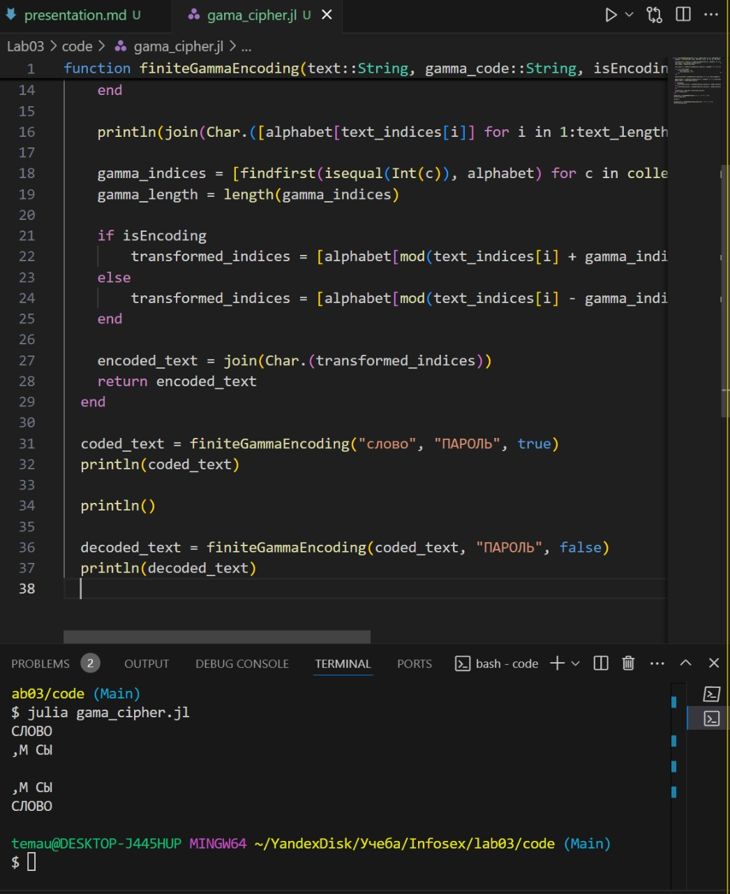

---
## Front matter
title: "Лабораторная работа № 3"
subtitle: "Шифрование гаммированием"
author: "Юрченко Артём Алексеевич"

## Generic options
lang: ru-RU
toc-title: "Содержание"

## PDF output format
toc: true # Table of contents
toc-depth: 2
fontsize: 12pt
papersize: a4
documentclass: beamer

## Fonts
mainfont: Noto Serif
romanfont: Noto Serif
sansfont: Noto Sans
monofont: Noto Mono
mainfontoptions: Ligatures=TeX
romanfontoptions: Ligatures=TeX
sansfontoptions: Ligatures=TeX,Scale=MatchLowercase
---

# Введение

## Введение

Шифрование гаммированием (поточное шифрование) – это метод симметричного шифрования, при котором открытый текст складывается по модулю с псевдослучайной последовательностью (гаммой). Гамма должна быть такой же длины, как и сообщение, и обычно генерируется на основе ключа.

## Цели и задачи

1. Изучить шифр гаммированием.

2. Реализовать шифр гаммированием конечной гаммой.

# Шифр гаммированием

## Реализация шифра гаммированием

Используя язык программирования Julia приступим к реализации кода для шифра гаммирования конечной гаммой.

## {width=50%}

# Итоги

## Заключение

В рамках данной лабораторной работы были получены практические навыки в написании шифрования гаммированиям на языке Julia.