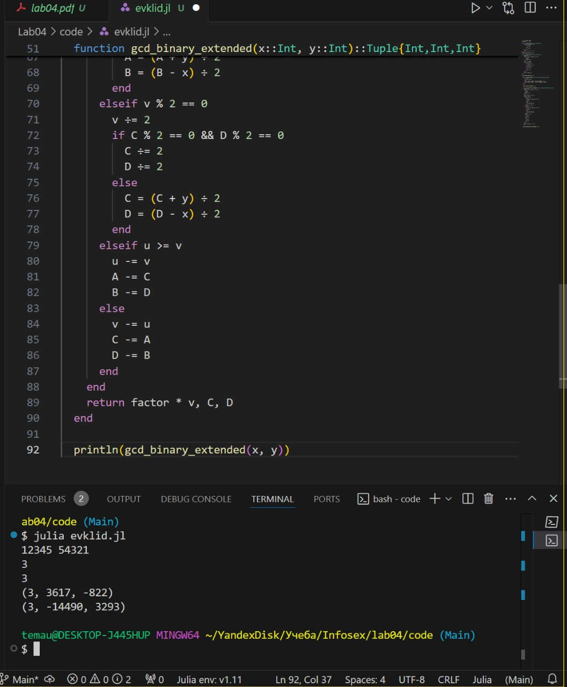

---
## Front matter
title: "ЛАБОРАТОРНАЯ РАБОТА № 4"
subtitle: "Вычисление наибольшего общего делителя"
author: "Юрченко Артём Алексеевич"

## Generic options
lang: ru-RU
toc-title: "Содержание"

## PDF output format
toc-depth: 2
fontsize: 12pt
linestretch: 1.5
papersize: a4
documentclass: scrreprt

## I18n
polyglossia-lang:
  name: russian
  options:
    - spelling=modern
    - babelshorthands=true
polyglossia-otherlangs:
  name: english

## Fonts
mainfont: Noto Serif
romanfont: Noto Serif
sansfont: Noto Sans
monofont: Noto Mono
mainfontoptions: Ligatures=TeX
romanfontoptions: Ligatures=TeX
sansfontoptions: Ligatures=TeX,Scale=MatchLowercase
monofontoptions: Scale=MatchLowercase,Scale=0.9

---

# Введение

В этой лабораторной работе рассматриваются различные алгоритмы нахождения НОД двух целых чисел. НОД – это наибольшее число, которое делит оба числа без остатка.

## Основные темы

- Алгоритм Евклида (классический)
- Бинарный алгоритм Евклида
- Расширенный алгоритм Евклида
- Расширенный бинарный алгоритм Евклида

# Кодовая реализация

Программная реализация 

# Заключение

В данной лабораторной работе Я реализую несколько алгоритмов для вычисления НОД двух чисел. Классический алгоритм Евклида использует деление с остатком, бинарный – операции сдвига и вычитания. Расширенные версии помогают не только найти НОД, но и разложить его в линейную комбинацию. Эти методы важны, например, в криптографии и теории чисел.