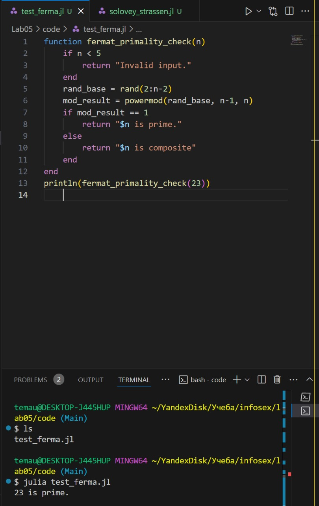
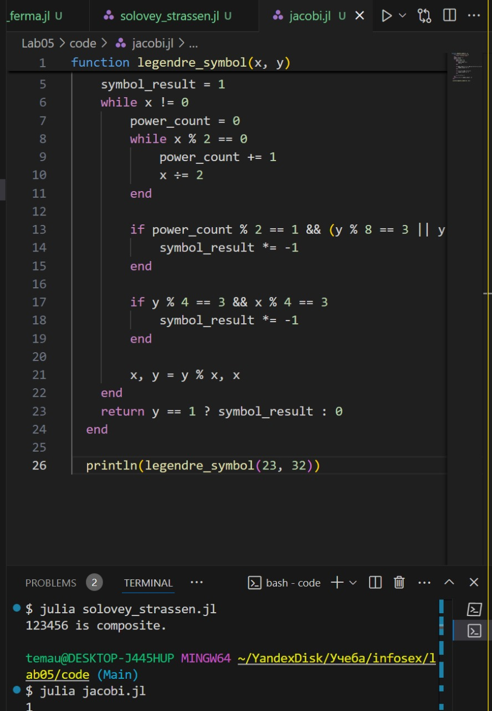

---
## Front matter
title: "Лабораторная работа № 5"
subtitle: "Вероятностные алгоритмы проверки чисел на простоту"
author: "Юрченко Артём Алексеевич"

## Generic options
lang: ru-RU
toc-title: "Содержание"

## PDF output format
toc: true # Table of contents
toc-depth: 2
fontsize: 12pt
papersize: a4
documentclass: beamer

## Fonts
mainfont: Noto Serif
romanfont: Noto Serif
sansfont: Noto Sans
monofont: Noto Mono
mainfontoptions: Ligatures=TeX
romanfontoptions: Ligatures=TeX
sansfontoptions: Ligatures=TeX,Scale=MatchLowercase
---

# Введение

## Введение

В данном отчёте будет представлена реализация алгоритмов проверки простоты числа.

## Основные алгоритмы 

- тест Ферма
- Алгоритм символа Якоби
- тест Соловэя-Штрассена
- тест Миллера-Рабина

# тест Ферма

## Реализация тест Ферма

Тест Ферма основан на критерии Эйлера.

## {width=50%}

# Алгоритм символа Якоби

## Реализация Алгоритм символа Якоби

В отличие от теста Ферма, алгоритм Якоби точнее, он основан на критерии Эйлера, который использует символ Якоби.

## {width=50%}

# Алгоритм Соловэя-Штрассена

## Реализация Алгоритма Соловэя-Штрассена

Программная реализация алгоритма, реализующего тест Соловэя-Штрассена

Самый часто используемый алгоритм проверки числа на простоту. 

## {width=50%}

# Алгоритм Миллера-Рабина

## Реализация Алгоритма Миллера-Рабина

Тест Миллера-Рабина – это стохастический алгоритм проверки чисел на простоту. Он основан на свойствах модульной арифметики и является усовершенствованной версией теста Ферма.

## {width=50%}

# Итоги

## Заключение

В данной лабораторной работе были реализованы шифры алгоритмы проверки числа на простоту.