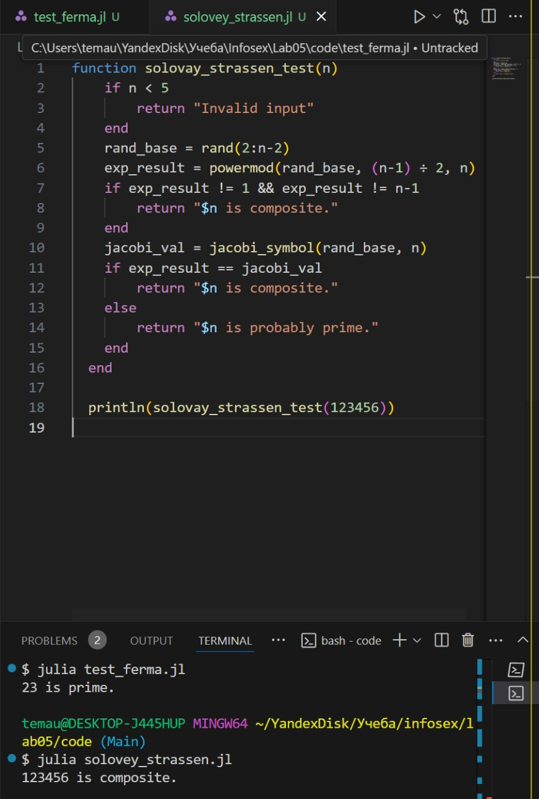
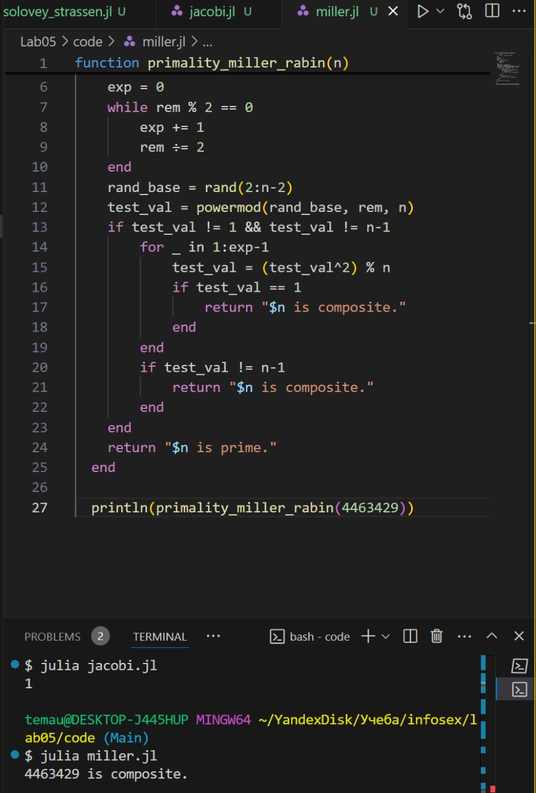

---
## Front matter
title: "ЛАБОРАТОРНАЯ РАБОТА № 5"
subtitle: "Вероятностные алгоритмы проверки чисел на простоту"
author: "Юрченко Артём Алексеевич"

## Generic options
lang: ru-RU
toc-title: "Содержание"

## PDF output format
toc-depth: 2
fontsize: 12pt
linestretch: 1.5
papersize: a4
documentclass: scrreprt

## I18n
polyglossia-lang:
  name: russian
  options:
    - spelling=modern
    - babelshorthands=true
polyglossia-otherlangs:
  name: english

## Fonts
mainfont: Noto Serif
romanfont: Noto Serif
sansfont: Noto Sans
monofont: Noto Mono
mainfontoptions: Ligatures=TeX
romanfontoptions: Ligatures=TeX
sansfontoptions: Ligatures=TeX,Scale=MatchLowercase
monofontoptions: Scale=MatchLowercase,Scale=0.9

---

# Введение

В данном отчёте будет представлена реализация алгоритмов проверки простоты числа.

## Основные алгоритмы

- тест Ферма
- Алгоритм символа Якоби
- тест Соловэя-Штрассена
- тест Миллера-Рабина

# Кодовая реализация

Программная реализация алгоритма, реализующего тест Ферма

Тест Ферма основан на критерии Эйлера.

Программная реализация алгоритма Якоби

В отличие от теста Ферма, алгоритм Якоби точнее, он основан на критерии Эйлера, который использует символ Якоби.

Программная реализация алгоритма, реализующего тест Соловэя-Штрассена

Самый часто используемый алгоритм проверки числа на простоту. 

Программная реализация алгоритма, реализующего тест Миллера-Рабина.

Тест Миллера-Рабина – это стохастический алгоритм проверки чисел на простоту. Он основан на свойствах модульной арифметики и является усовершенствованной версией теста Ферма.

# Заключение

В данной лабораторной работе были реализованы шифры алгоритмы проверки числа на простоту.