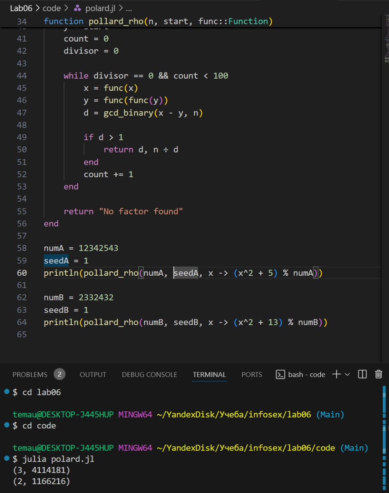

---
## Front matter
title: "Лабораторная работа № 6"
subtitle: "Разложение чисел на множители"
author: "Юрченко Артём Алексеевич"

## Generic options
lang: ru-RU
toc-title: "Содержание"

## PDF output format
toc: true # Table of contents
toc-depth: 2
fontsize: 12pt
papersize: a4
documentclass: beamer

## Fonts
mainfont: Noto Serif
romanfont: Noto Serif
sansfont: Noto Sans
monofont: Noto Mono
mainfontoptions: Ligatures=TeX
romanfontoptions: Ligatures=TeX
sansfontoptions: Ligatures=TeX,Scale=MatchLowercase
---

# Введение

## Введение

Задача разложения числа на множители - одна из первых задач, использованных для построения криптосистем с открытым ключом.

## Цели и задачи

1. Изучить методы разложения числа на множители.

2. Реализовать алгоритм, реализующий р-метод Полларда.

# Р-метод Полларда

## Реализация алгоритма, реализующий р-метод Полларда

Основан на идее, что если применить специальную рекуррентную функцию к случайному числу, то значения будут "зацикливаться".

## Программная реализация алгоритма, реализующего р-метод Полларда.
{width=60%}

# Итоги

## Заключение

Метод Полларда показывает хорошую эффективность для чисел с малыми делителями, но может работать долго при разложении чисел с большими простыми множителями.
Метод квадратов подходит для чисел, имеющих множители примерно одинакового размера, но его применение требует специальных условий.
Разложение чисел на множители – сложная задача, и современные криптосистемы используют именно эту сложность для обеспечения безопасности.