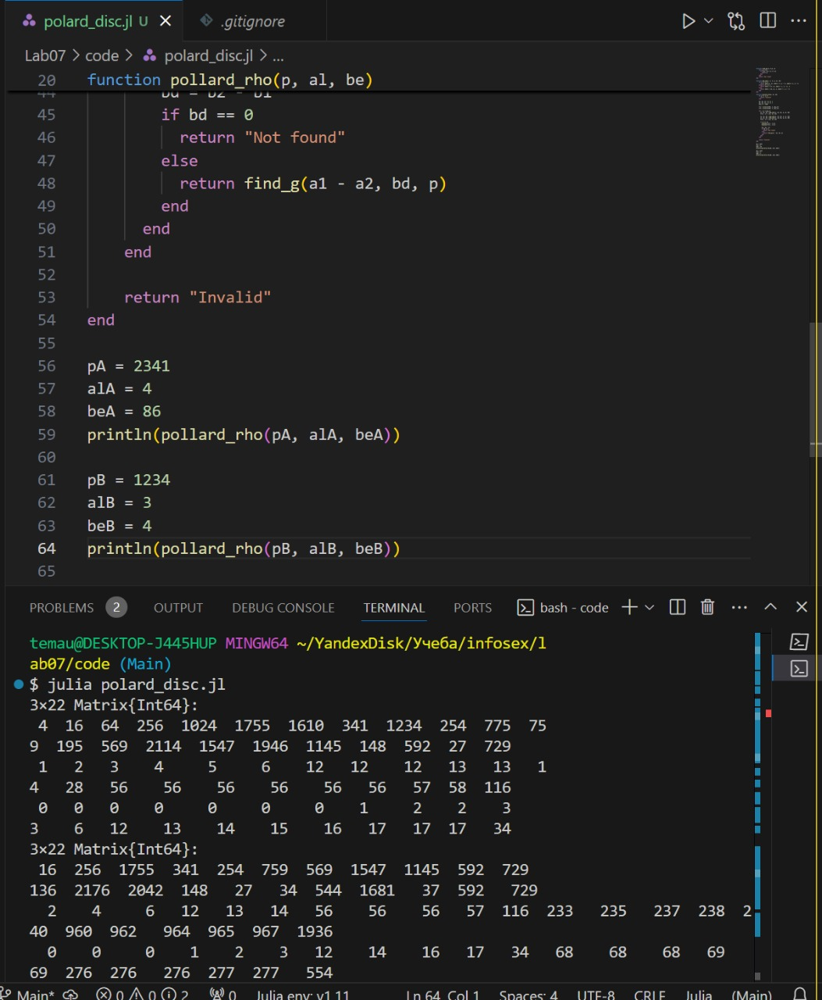

---
## Front matter
title: "Лабораторная работа № 7"
subtitle: "Дискретное логарифмирование в конечном виде"
author: "Юрченко Артём Алексеевич"

## Generic options
lang: ru-RU
toc-title: "Содержание"

## PDF output format
toc: true # Table of contents
toc-depth: 2
fontsize: 12pt
papersize: a4
documentclass: beamer

## Fonts
mainfont: Noto Serif
romanfont: Noto Serif
sansfont: Noto Sans
monofont: Noto Mono
mainfontoptions: Ligatures=TeX
romanfontoptions: Ligatures=TeX
sansfontoptions: Ligatures=TeX,Scale=MatchLowercase
---

# Введение

## Введение

Дискретное логарифмирование – одна из ключевых задач в криптографии. Оно используется в алгоритмах, таких как Diffie-Hellman и эллиптические кривые, обеспечивающих защиту данных

## Цели и задачи

1. Разобраться с понятием конечного поля и его свойствами.
2. Ознакомиться с p-методом Полларда, который решает задачу дискретного логарифмирования.
3. Реализовать этот алгоритм программно и проверить его на практике.

#  алгоритм p-метода Полларда

## Реализация р-метода Полларда.

Этот метод основан на случайном отображении (функции), которое сжимает входные значения и помогает найти логарифм x.

## {width=50%}

# Итоги

## Заключение

В данной лабораторной работе был реализован p-метод Полларда для поиска дискретного логарифма. Подтверждена сложность задачи дискретного логарифмирования, что объясняет безопасность криптографических систем.