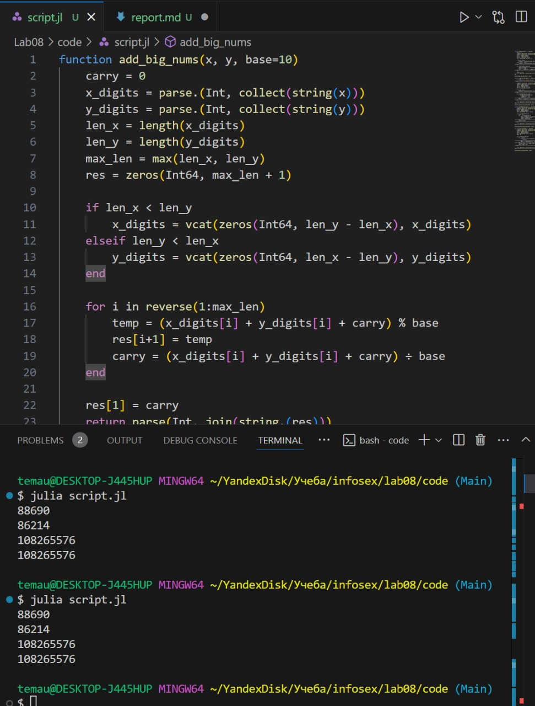

---
## Front matter
title: "Лабораторная работа № 8"
subtitle: "Целочисленная арифметика многократной точности"
author: "Юрченко Артём Алексеевич"

## Generic options
lang: ru-RU
toc-title: "Содержание"

## PDF output format
toc: true # Table of contents
toc-depth: 2
fontsize: 12pt
papersize: a4
documentclass: beamer

## Fonts
mainfont: Noto Serif
romanfont: Noto Serif
sansfont: Noto Sans
monofont: Noto Mono
mainfontoptions: Ligatures=TeX
romanfontoptions: Ligatures=TeX
sansfontoptions: Ligatures=TeX,Scale=MatchLowercase
---

# Введение

## Введение

В данной лабораторной работе рассматриваются методы работы с большими целыми числами, которые не помещаются в стандартные типы данных. Такие методы используются в криптографии, научных вычислениях и других областях, требующих точных арифметических операций.

## Цели и задачи

1. Изучить представление больших чисел в разрядной форме.

2. Реализовать основные арифметические операции:
- Сложение
- Вычитание
- Умножение
- Деление

3. Научиться эффективно работать с многоразрядными числами в программировании.

# Целочисленная арифметика многократной точности

## Кодовая реализация

Основные функции в коде:
1. Функция сложения больших чисел
- Использует поразрядное сложение с переносом.
- Обрабатывает числа, представленные в виде массивов разрядов.

2. Функция вычитания больших чисел
- Работает аналогично сложению, но с учетом заемов при вычитании.

3. Функция умножения "в столбик"
- Перебирает разряды одного числа, умножая их на разряды второго.
- Складывает промежуточные результаты.

4. Функция быстрого умножения
- Оптимизирована для быстрого выполнения, использует аккумулирующий счетчик.

5. Функция деления больших чисел
- Реализует поразрядное деление, аналогичное длинному делению "в столбик".
- Включает методы поиска частного и проверки остатка.

{width=50%}

# Итоги

## Заключение

В данной лабораторной работе были реализованы основные арифметические операции с большими числами, включая сложение, вычитание, умножение и деление. Это позволило изучить разрядные вычисления и их оптимизацию, что важно для криптографии и научных расчетов.